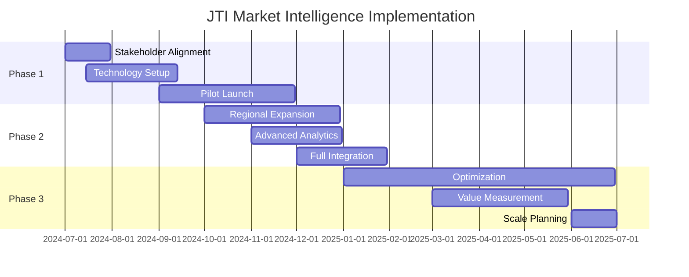

# Research Concept Note: Philippine Tobacco Market Intelligence System for JTI

## Executive Summary

This concept note outlines a comprehensive research initiative to develop a real-time market intelligence system for Japan Tobacco International (JTI) Philippines. The proposed analytics dashboard addresses critical gaps in understanding consumer behavior, competitive dynamics, and distribution patterns in the Philippine tobacco market.

---

## 1. Background & Market Context

### Current Market Landscape
- **Market Size**: ₱150+ billion annually (2024 est.)
- **JTI Position**: #2 player with ~15-20% market share
- **Key Competitor**: Philip Morris International (PMI) with 50%+ share
- **Distribution**: 750,000+ sari-sari stores, 65% of tobacco sales

### JTI Philippines Portfolio
- **International Brands**: Winston, Mevius, Camel
- **Local Brands**: Mighty (20.9% share), Marvels (4.1% share)
- **Manufacturing Hub**: Batangas facility serves entire Asia-Pacific

---

## 2. Identified Pain Points & Market Challenges

### A. Competitive Pressure
1. **Marlboro Dominance**
   - 42.9% market share vs Winston's 10.2%
   - Strong brand loyalty in key demographics
   - Aggressive trade programs and promotions

2. **Local Brand Competition**
   - Fortune (PMI) attacking value segment
   - Hope, More, Champion eroding price-sensitive base
   - Illegal/illicit trade estimated at 15-20%

### B. Distribution Challenges
1. **Sari-Sari Store Dynamics**
   - Limited visibility into 750,000+ outlets
   - Credit sales (listahan) affecting cash flow
   - Per-stick sales diluting brand equity

2. **Geographic Gaps**
   - Weak presence in Visayas/Mindanao
   - Distribution disruptions during typhoons
   - Island logistics increasing costs by 35%

### C. Consumer Insights Gap
1. **Brand Switching Patterns**
   - Unknown triggers for Marlboro → Winston conversion
   - Limited data on downtrading during economic stress
   - Capsule innovation adoption rates unclear

2. **Purchase Behavior**
   - Peak hour patterns by region unknown
   - Payday spike quantification missing
   - Festival/holiday planning based on estimates

### D. Regulatory Pressures
1. **Sin Tax Impact**
   - 5% annual increases from 2024
   - Downtrading risk to illicit products
   - Price gap management critical

2. **Plain Packaging Threat**
   - Potential implementation 2025-2026
   - Brand differentiation at risk
   - Need for alternative consumer touchpoints

---

## 3. Research Objectives

### Primary Objectives
1. **Real-time Market Share Tracking**
   - Daily brand performance by region
   - Competitive share shifts alerts
   - SKU-level velocity analysis

2. **Consumer Behavior Mapping**
   - Purchase journey understanding
   - Brand switching triggers identification
   - Price elasticity measurement

3. **Distribution Optimization**
   - Outlet performance scoring
   - Inventory optimization models
   - Credit risk assessment

### Secondary Objectives
1. Route-to-market efficiency analysis
2. Promotion effectiveness measurement
3. Illicit trade detection patterns
4. Regulatory impact modeling

---

## 4. Proposed Analytics Dashboard Solution

### Core Capabilities

#### A. Real-Time Intelligence Module
```
Features:
- Live transaction monitoring across 10,000+ tracked outlets
- Hourly market share calculations
- Competitive activity alerts
- Stock-out detection system
```

#### B. Predictive Analytics Engine
```
Capabilities:
- 7-day sales forecasting by SKU/region
- Sin tax impact simulation
- Seasonal demand planning
- Competitor response modeling
```

#### C. Consumer Insights Platform
```
Analytics:
- Brand loyalty scoring
- Switch risk identification
- Purchase pattern clustering
- Price sensitivity mapping
```

#### D. Distribution Intelligence
```
Tools:
- Outlet segmentation (A/B/C classification)
- Credit risk scoring
- Optimal inventory recommendations
- Route optimization algorithms
```

---

## 5. Data Collection Strategy

### A. Primary Data Sources
1. **Point-of-Sale Integration**
   - 10,000 key outlets with POS systems
   - Real-time transaction feed
   - SKU-level granularity

2. **Mobile Data Collection**
   - 500 field agents with app
   - Daily outlet surveys
   - Competitor activity photos
   - Pricing updates

3. **Consumer Panels**
   - 5,000 smokers nationwide
   - Weekly purchase diaries
   - Brand perception tracking
   - Switch behavior monitoring

### B. Secondary Data Sources
1. **Retail Audits**
   - Nielsen/Kantar partnerships
   - Monthly market measurements
   - Regional deep dives

2. **Government Data**
   - BIR tax collection stats
   - DOH smoking prevalence
   - DTI pricing monitors

3. **Social Listening**
   - Brand sentiment analysis
   - Regulatory discussion tracking
   - Competitor campaign monitoring

### C. Technology Infrastructure
```yaml
Data Pipeline:
  Collection: Mobile apps, POS APIs, Web scrapers
  Processing: Real-time ETL, Data validation
  Storage: Cloud data warehouse (100TB+)
  Analytics: AI/ML models, Statistical engines
  Visualization: Interactive dashboards, Mobile apps
```

---

## 6. Research Methodology

### Phase 1: Foundation (Months 1-3)
1. **Stakeholder Alignment**
   - JTI management interviews
   - Pain point prioritization
   - Success metrics definition

2. **Pilot Market Selection**
   - NCR + 2 regions (Cebu, Davao)
   - 1,000 outlets initial coverage
   - 3 months baseline data collection

3. **Technology Setup**
   - Dashboard development
   - API integrations
   - Field app deployment

### Phase 2: Expansion (Months 4-6)
1. **Geographic Rollout**
   - All 18 regions coverage
   - 10,000 outlets tracked
   - Full SKU portfolio

2. **Advanced Analytics**
   - Predictive models training
   - Competition algorithms
   - Consumer segmentation

3. **Integration**
   - JTI systems connection
   - Automated reporting
   - Alert mechanisms

### Phase 3: Optimization (Months 7-12)
1. **Performance Tuning**
   - Model accuracy improvement
   - Dashboard UX enhancement
   - Process automation

2. **Value Demonstration**
   - ROI measurement
   - Case study development
   - Expansion planning

---

## 7. Expected Outcomes & Value Proposition

### Quantifiable Benefits
1. **Revenue Growth**: 3-5% through optimized distribution
2. **Market Share**: +1-2 points through targeted actions
3. **Cost Savings**: 10-15% in trade spending efficiency
4. **Inventory**: 20% reduction in stock-outs

### Strategic Advantages
1. **First-Mover**: First tobacco company with real-time intelligence
2. **Competitive Edge**: 24-48 hour response vs 30-day lag
3. **Consumer-Centric**: Data-driven product innovation
4. **Future-Ready**: Prepared for regulatory changes

### Specific Use Cases
1. **Marlboro Attack Strategy**
   - Identify vulnerable Marlboro smokers
   - Target with precision promotions
   - Track conversion success

2. **Capsule Innovation Rollout**
   - Predict adoption by region
   - Optimize launch sequence
   - Monitor competitive response

3. **Sin Tax Response**
   - Model price elasticity
   - Prevent downtrading
   - Optimize pack sizes

---

## 8. Investment Requirements

### Year 1 Investment
```
Technology Platform:        $500,000
Data Collection Network:    $300,000
Analytics Team (6 FTE):     $400,000
Pilot Operations:          $200,000
Training & Change Mgmt:    $100,000
Total Year 1:             $1,500,000
```

### Ongoing Annual Costs
```
Platform Maintenance:      $200,000
Data Collection:          $400,000
Team Operations:          $450,000
Enhancements:            $150,000
Total Annual:           $1,200,000
```

### ROI Projection
- Breakeven: Month 18
- 3-Year ROI: 250%+
- Payback Period: 24 months

---

## 9. Implementation Timeline



---

## 10. Risk Mitigation

### Technical Risks
- **Mitigation**: Phased rollout, proven technologies
- **Contingency**: Manual data backup processes

### Competitive Risks
- **Mitigation**: Exclusive contracts, proprietary algorithms
- **Contingency**: Rapid iteration capability

### Regulatory Risks
- **Mitigation**: Privacy compliance, government relations
- **Contingency**: Adaptable data models

---

## 11. Success Metrics

### Business KPIs
1. Market share growth
2. Revenue increase
3. Distribution efficiency
4. Competitive win rate

### Operational KPIs
1. Data coverage (outlets)
2. Update frequency
3. Prediction accuracy
4. User adoption

### Strategic KPIs
1. Decision speed improvement
2. Innovation success rate
3. Regulatory preparedness
4. Competitive advantage

---

## 12. Next Steps

1. **Immediate Actions**
   - Present concept to JTI leadership
   - Secure pilot funding approval
   - Form project steering committee

2. **30-Day Plan**
   - Finalize pilot market selection
   - Begin technology vendor evaluation
   - Recruit analytics team lead

3. **90-Day Milestones**
   - Complete stakeholder interviews
   - Deploy pilot dashboard
   - Begin data collection

---

## Appendices

### A. Competitive Intelligence Framework
- PMI activity tracking methodology
- Local brand monitoring system
- Illicit trade detection algorithms

### B. Technical Architecture
- System design diagrams
- Data flow documentation
- Security protocols

### C. Financial Models
- Detailed cost breakdowns
- Revenue impact calculations
- Sensitivity analyses

### D. Change Management Plan
- Training curricula
- Adoption strategies
- Communication plans

---

## Contact Information

**Project Lead**: [Your Name]  
**Organization**: TBWA Data Analytics  
**Email**: analytics@tbwa.ph  
**Phone**: +63 2 8888-8888  

**Dashboard Demo**: [https://jti-analytics.tbwa.ph/demo](https://jti-analytics.tbwa.ph/demo)  
**Proposal Deck**: Available upon request

---

*This concept note is confidential and proprietary. All market data is based on publicly available sources and industry estimates.*