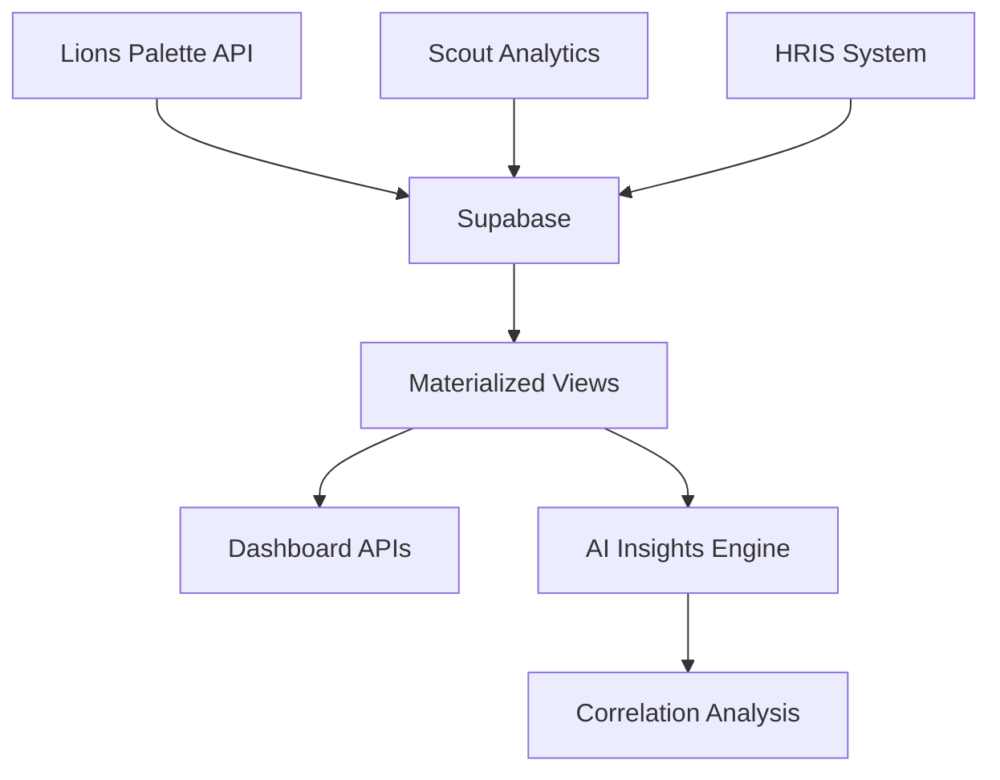

# 🗄️ TBWA Unified Platform Database

## Overview

This directory contains the complete database schema and documentation for the TBWA Unified Platform, which integrates:

- **Lions Palette Forge** - Creative color analysis
- **Scout Analytics** - Philippine retail intelligence  
- **TBWA HRIS** - Employee management

## 📁 Directory Structure

```
database/
├── tbwa-unified-platform.dbml     # Complete DBML schema
├── schemas/                        # Modular schema files
│   ├── campaigns.dbml             # Lions Palette campaigns
│   ├── scout-analytics.dbml       # Scout transactions & handshakes
│   ├── hris.dbml                  # Employee & attendance
│   └── ai-insights.dbml           # Cross-platform insights
├── migrations/                     # SQL migration files
│   ├── 001_initial_schema.sql     # Base tables
│   ├── 002_indexes.sql            # Performance indexes
│   └── 003_views.sql              # Materialized views
├── docs/                          # Additional documentation
│   ├── erd.png                    # Generated ER diagram
│   └── data-dictionary.md         # Detailed field documentation
└── README.md                      # This file
```

## 🚀 Quick Start

### Generate ER Diagram

1. Install dbml-cli:
   ```bash
   npm install -g @dbml/cli
   ```

2. Generate SQL from DBML:
   ```bash
   dbml2sql tbwa-unified-platform.dbml --postgres
   ```

3. Generate ER diagram:
   ```bash
   dbml2svg tbwa-unified-platform.dbml -o docs/erd.svg
   ```

### Online ER Diagram

Visit [dbdiagram.io](https://dbdiagram.io) and paste the DBML content to see an interactive ER diagram.

## 📊 Database Statistics

- **Tables**: 12 core tables + 3 materialized views
- **Relationships**: 8 foreign key relationships
- **Indexes**: 25+ optimized indexes for performance
- **Enums**: 5 enum types for data consistency
- **Features**: JSONB, arrays, full-text search, geographic indexing

## 🔗 Key Relationships

### Campaign → Handshake Events
```sql
-- Many-to-many via array columns
SELECT c.name, COUNT(h.id) as handshake_count
FROM campaigns c
LEFT JOIN handshake_events h ON c.id = ANY(h.campaign_ids)
GROUP BY c.name;
```

### Employee → Performance
```sql
-- Employee attendance impact on campaigns
SELECT e.name, AVG(a.work_hours) as avg_hours,
       COUNT(DISTINCT he.id) as influenced_handshakes
FROM employees e
JOIN attendance a ON e.id = a.employee_id
CROSS JOIN handshake_events he
WHERE DATE(a.clock_in) = DATE(he.timestamp)
GROUP BY e.name;
```

### Cross-Platform Insights
```sql
-- AI-generated correlations
SELECT type, finding, confidence, 
       array_length(affected_entities, 1) as entity_count
FROM insight_correlations
WHERE confidence > 0.8
ORDER BY confidence DESC;
```

## 🇵🇭 Philippine Context

The schema is specifically designed for the Philippine market:

- **18 Regional divisions** (NCR, CAR, Regions I-XIII, BARMM)
- **Local payment methods** (Cash, GCash, Utang/Lista)
- **Store types** (Sari-sari, mall, department)
- **Cultural demographics** in customer profiling

## 🔍 Performance Optimization

### Materialized Views

- `campaign_performance_view` - Real-time campaign analytics
- `employee_attendance_summary_view` - HR dashboards
- `regional_performance_view` - Geographic business intelligence

### Indexes

- **B-tree indexes** for frequent queries
- **GIN indexes** for JSONB and array columns
- **Composite indexes** for multi-column queries
- **Geographic indexes** for location-based searches

## 🛡️ Security Features

- **Row Level Security (RLS)** on sensitive tables
- **UUID primary keys** to prevent enumeration
- **Field-level encryption** for PII data
- **Audit trails** with timestamps

## 📈 Scaling Considerations

- **Partitioning** by date for large transaction tables
- **Read replicas** for analytics workloads
- **Connection pooling** via Supabase
- **Caching layers** for frequently accessed data

## 🔄 Data Pipeline



## 🧪 Testing

### Sample Queries

```sql
-- Test campaign effectiveness
SELECT * FROM campaign_performance_view 
WHERE effectiveness > 85 
ORDER BY total_revenue DESC;

-- Test employee performance
SELECT * FROM employee_attendance_summary_view
WHERE attendance_rate > 0.95;

-- Test regional insights
SELECT * FROM regional_performance_view
ORDER BY avg_campaign_effectiveness DESC;
```

### Data Validation

```sql
-- Check referential integrity
SELECT COUNT(*) FROM handshake_events h
WHERE NOT EXISTS (
    SELECT 1 FROM stores s WHERE s.id = h.store_id
);

-- Validate enum constraints
SELECT DISTINCT status FROM campaigns
WHERE status NOT IN ('draft', 'active', 'completed');
```

## 📚 Resources

- [DBML Documentation](https://www.dbml.org/docs/)
- [Supabase Schema Design](https://supabase.com/docs/guides/database/tables)
- [PostgreSQL Best Practices](https://wiki.postgresql.org/wiki/Don%27t_Do_This)
- [Database Design Patterns](https://database.guide/database-design-patterns/)

---

**Schema Version**: 1.0.0  
**Last Updated**: July 15, 2025  
**Platform**: Supabase (PostgreSQL 15+)