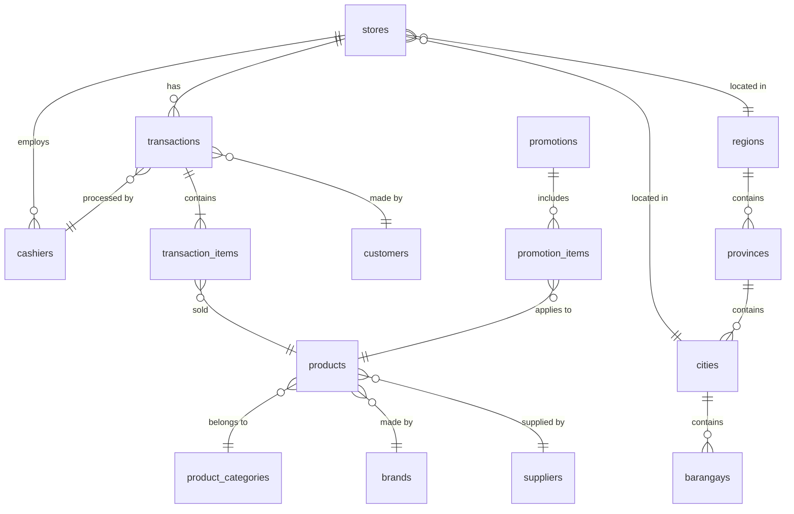

# Scout Analytics Database Dictionary

**Version:** 1.0  
**Last Updated:** July 1, 2025  
**Purpose:** Complete reference for all database objects including tables, views, functions, triggers, and RLS policies

---

## Table of Contents

1. [Core Master Data Tables](#core-master-data-tables)
2. [Transaction Tables](#transaction-tables)
3. [Geographic Tables (New)](#geographic-tables-new)
4. [Analytics Tables](#analytics-tables)
5. [Views](#views)
6. [Functions](#functions)
7. [Triggers](#triggers)
8. [RLS Policies](#rls-policies)
9. [ERD Overview](#erd-overview)

---

## Core Master Data Tables

### 1. stores
**Purpose:** Physical store locations and metadata

| Column | Type | Constraints | Description |
|--------|------|-------------|-------------|
| id | UUID | PRIMARY KEY | Unique store identifier |
| store_code | VARCHAR(50) | UNIQUE NOT NULL | Store code (e.g., "STR001") |
| store_name | VARCHAR(100) | NOT NULL | Display name |
| region | VARCHAR(100) | | Region name (to be normalized) |
| province | VARCHAR(100) | | Province name (optional) |
| city | VARCHAR(100) | | City/municipality name |
| barangay | VARCHAR(100) | | Barangay name |
| address | TEXT | | Full address |
| latitude | DECIMAL(10,8) | | GPS latitude |
| longitude | DECIMAL(11,8) | | GPS longitude |
| store_type | VARCHAR(50) | | Type: "Sari-sari", "Convenience", etc. |
| status | VARCHAR(20) | DEFAULT 'active' | active/inactive/suspended |
| created_at | TIMESTAMP | DEFAULT NOW() | Record creation |
| updated_at | TIMESTAMP | DEFAULT NOW() | Last update |
| region_id | UUID | FK regions(id) | Normalized region (new) |
| province_id | UUID | FK provinces(id) | Normalized province (new) |
| city_id | UUID | FK cities(id) | Normalized city (new) |
| barangay_id | UUID | FK barangays(id) | Normalized barangay (new) |
| location_point | GEOMETRY(Point,4326) | | PostGIS point (new) |

**Indexes:**
- idx_stores_region ON region
- idx_stores_city ON city
- idx_stores_status ON status
- idx_stores_location ON location_point USING GIST (new)

### 2. products
**Purpose:** Product catalog with pricing

| Column | Type | Constraints | Description |
|--------|------|-------------|-------------|
| id | UUID | PRIMARY KEY | Unique product identifier |
| barcode | VARCHAR(50) | UNIQUE | Product barcode/UPC |
| sku | VARCHAR(50) | UNIQUE NOT NULL | Stock keeping unit |
| product_name | VARCHAR(200) | NOT NULL | Display name |
| description | TEXT | | Product description |
| category_id | UUID | FK product_categories(id) | Product category |
| brand_id | UUID | FK brands(id) | Product brand |
| supplier_id | UUID | FK suppliers(id) | Primary supplier |
| current_price | DECIMAL(10,2) | NOT NULL | Current selling price |
| cost_price | DECIMAL(10,2) | | Cost/wholesale price |
| unit_of_measure | VARCHAR(20) | | pc/kg/liter/pack |
| pack_size | VARCHAR(50) | | e.g., "12x250ml" |
| is_active | BOOLEAN | DEFAULT true | Product availability |
| created_at | TIMESTAMP | DEFAULT NOW() | Record creation |
| updated_at | TIMESTAMP | DEFAULT NOW() | Last update |

**Indexes:**
- idx_products_barcode ON barcode
- idx_products_sku ON sku
- idx_products_category ON category_id
- idx_products_brand ON brand_id
- idx_products_active ON is_active

### 3. product_categories
**Purpose:** Hierarchical product categorization

| Column | Type | Constraints | Description |
|--------|------|-------------|-------------|
| id | UUID | PRIMARY KEY | Unique category identifier |
| category_code | VARCHAR(20) | UNIQUE NOT NULL | Category code |
| category_name | VARCHAR(100) | NOT NULL | Display name |
| parent_category_id | UUID | FK product_categories(id) | Parent for hierarchy |
| level | INTEGER | | Hierarchy level (0=root) |
| sort_order | INTEGER | | Display order |
| is_active | BOOLEAN | DEFAULT true | Category status |
| created_at | TIMESTAMP | DEFAULT NOW() | Record creation |

**Indexes:**
- idx_categories_code ON category_code
- idx_categories_parent ON parent_category_id

### 4. brands
**Purpose:** Product brand management

| Column | Type | Constraints | Description |
|--------|------|-------------|-------------|
| id | UUID | PRIMARY KEY | Unique brand identifier |
| brand_code | VARCHAR(20) | UNIQUE NOT NULL | Brand code |
| brand_name | VARCHAR(100) | NOT NULL | Display name |
| manufacturer | VARCHAR(100) | | Parent company |
| country_of_origin | VARCHAR(50) | | Origin country |
| is_local | BOOLEAN | DEFAULT false | Local vs international |
| is_active | BOOLEAN | DEFAULT true | Brand status |
| created_at | TIMESTAMP | DEFAULT NOW() | Record creation |

**Indexes:**
- idx_brands_code ON brand_code
- idx_brands_manufacturer ON manufacturer

### 5. suppliers
**Purpose:** Product supplier information

| Column | Type | Constraints | Description |
|--------|------|-------------|-------------|
| id | UUID | PRIMARY KEY | Unique supplier identifier |
| supplier_code | VARCHAR(20) | UNIQUE NOT NULL | Supplier code |
| supplier_name | VARCHAR(100) | NOT NULL | Company name |
| contact_person | VARCHAR(100) | | Primary contact |
| phone | VARCHAR(50) | | Contact number |
| email | VARCHAR(100) | | Email address |
| address | TEXT | | Business address |
| payment_terms | VARCHAR(50) | | NET30/COD/etc |
| is_active | BOOLEAN | DEFAULT true | Supplier status |
| created_at | TIMESTAMP | DEFAULT NOW() | Record creation |

**Indexes:**
- idx_suppliers_code ON supplier_code
- idx_suppliers_active ON is_active

### 6. customers
**Purpose:** Customer records with loyalty tracking

| Column | Type | Constraints | Description |
|--------|------|-------------|-------------|
| id | UUID | PRIMARY KEY | Unique customer identifier |
| customer_code | VARCHAR(20) | UNIQUE | Customer number |
| first_name | VARCHAR(50) | | First name |
| last_name | VARCHAR(50) | | Last name |
| phone | VARCHAR(50) | | Contact number |
| email | VARCHAR(100) | | Email address |
| customer_type | VARCHAR(20) | | Regular/Student/Senior/PWD |
| loyalty_card_number | VARCHAR(50) | UNIQUE | Loyalty card ID |
| points_balance | INTEGER | DEFAULT 0 | Current points |
| lifetime_value | DECIMAL(12,2) | DEFAULT 0 | Total purchases |
| registration_date | DATE | | Sign-up date |
| last_purchase_date | DATE | | Last transaction |
| is_active | BOOLEAN | DEFAULT true | Customer status |
| created_at | TIMESTAMP | DEFAULT NOW() | Record creation |

**Indexes:**
- idx_customers_code ON customer_code
- idx_customers_phone ON phone
- idx_customers_loyalty ON loyalty_card_number
- idx_customers_type ON customer_type

### 7. cashiers
**Purpose:** Store employee records

| Column | Type | Constraints | Description |
|--------|------|-------------|-------------|
| id | UUID | PRIMARY KEY | Unique cashier identifier |
| employee_code | VARCHAR(20) | UNIQUE NOT NULL | Employee ID |
| first_name | VARCHAR(50) | NOT NULL | First name |
| last_name | VARCHAR(50) | NOT NULL | Last name |
| store_id | UUID | FK stores(id) | Assigned store |
| phone | VARCHAR(50) | | Contact number |
| hire_date | DATE | | Employment start |
| status | VARCHAR(20) | DEFAULT 'active' | active/inactive/suspended |
| pin_code | VARCHAR(100) | | Hashed PIN for POS |
| created_at | TIMESTAMP | DEFAULT NOW() | Record creation |

**Indexes:**
- idx_cashiers_code ON employee_code
- idx_cashiers_store ON store_id
- idx_cashiers_status ON status

### 8. geography
**Purpose:** Legacy geographic lookup table (to be deprecated)

| Column | Type | Constraints | Description |
|--------|------|-------------|-------------|
| id | UUID | PRIMARY KEY | Unique identifier |
| region | VARCHAR(100) | | Region name |
| city_municipality | VARCHAR(100) | | City/municipality |
| barangay | VARCHAR(100) | | Barangay name |
| store_name | VARCHAR(100) | | Associated store |
| latitude | DECIMAL(10,8) | | GPS latitude |
| longitude | DECIMAL(11,8) | | GPS longitude |
| store_type | VARCHAR(50) | | Store classification |

---

## Transaction Tables

### 9. transactions
**Purpose:** POS transaction headers

| Column | Type | Constraints | Description |
|--------|------|-------------|-------------|
| id | UUID | PRIMARY KEY | Unique transaction ID |
| receipt_number | VARCHAR(50) | UNIQUE NOT NULL | Receipt/invoice number |
| transaction_date | DATE | NOT NULL | Transaction date |
| transaction_time | TIME | NOT NULL | Transaction time |
| datetime | TIMESTAMP | NOT NULL | Full timestamp |
| store_id | UUID | FK stores(id) | Transaction location |
| cashier_id | UUID | FK cashiers(id) | Employee who processed |
| customer_id | UUID | FK customers(id) | Customer (if known) |
| subtotal | DECIMAL(10,2) | NOT NULL | Pre-tax/discount total |
| discount_amount | DECIMAL(10,2) | DEFAULT 0 | Total discounts |
| tax_amount | DECIMAL(10,2) | DEFAULT 0 | Total tax |
| total_amount | DECIMAL(10,2) | NOT NULL | Final amount |
| payment_method | VARCHAR(50) | | Cash/GCash/Card/etc |
| items_count | INTEGER | | Number of line items |
| status | VARCHAR(20) | DEFAULT 'completed' | completed/void/return |
| void_reason | TEXT | | If voided |
| created_at | TIMESTAMP | DEFAULT NOW() | Record creation |
| geography_id | UUID | FK geography(id) | Legacy geo reference |

**Indexes:**
- idx_transactions_date ON transaction_date
- idx_transactions_datetime ON datetime
- idx_transactions_store ON store_id
- idx_transactions_customer ON customer_id
- idx_transactions_receipt ON receipt_number

### 10. transaction_items
**Purpose:** Transaction line items detail

| Column | Type | Constraints | Description |
|--------|------|-------------|-------------|
| id | UUID | PRIMARY KEY | Unique line item ID |
| transaction_id | UUID | FK transactions(id) | Parent transaction |
| product_id | UUID | FK products(id) | Product sold |
| barcode | VARCHAR(50) | | Product barcode |
| product_name | VARCHAR(200) | | Product name at sale |
| quantity | DECIMAL(10,3) | NOT NULL | Quantity sold |
| unit_price | DECIMAL(10,2) | NOT NULL | Price per unit |
| discount_amount | DECIMAL(10,2) | DEFAULT 0 | Line discount |
| tax_amount | DECIMAL(10,2) | DEFAULT 0 | Line tax |
| line_total | DECIMAL(10,2) | NOT NULL | Line amount |
| cost_price | DECIMAL(10,2) | | Cost at time of sale |
| profit_amount | DECIMAL(10,2) | | Calculated profit |
| promo_code | VARCHAR(50) | | Applied promotion |
| created_at | TIMESTAMP | DEFAULT NOW() | Record creation |

**Indexes:**
- idx_transaction_items_transaction ON transaction_id
- idx_transaction_items_product ON product_id

---

## Geographic Tables (New)

### 11. regions
**Purpose:** Philippine regions with boundaries

| Column | Type | Constraints | Description |
|--------|------|-------------|-------------|
| id | UUID | PRIMARY KEY | Unique region ID |
| region_code | VARCHAR(10) | UNIQUE NOT NULL | Region code |
| region_name | VARCHAR(100) | NOT NULL | Standard name |
| region_name_alt | VARCHAR(100) | | Alternative name |
| island_group | VARCHAR(50) | | Luzon/Visayas/Mindanao |
| boundary_polygon | JSONB | | GeoJSON from GADM |
| geometry | GEOMETRY(MultiPolygon,4326) | | PostGIS geometry |
| center_lat | DECIMAL(10,8) | | Calculated centroid |
| center_lng | DECIMAL(11,8) | | Calculated centroid |
| area_sq_km | DECIMAL(10,2) | | Calculated area |
| created_at | TIMESTAMP | DEFAULT NOW() | Record creation |
| updated_at | TIMESTAMP | DEFAULT NOW() | Last update |

**Indexes:**
- idx_regions_geometry ON geometry USING GIST
- idx_regions_code ON region_code

### 12. provinces
**Purpose:** Philippine provinces with boundaries

| Column | Type | Constraints | Description |
|--------|------|-------------|-------------|
| id | UUID | PRIMARY KEY | Unique province ID |
| province_code | VARCHAR(10) | UNIQUE NOT NULL | Province code |
| province_name | VARCHAR(100) | NOT NULL | Province name |
| region_id | UUID | FK regions(id) | Parent region |
| boundary_polygon | JSONB | | GeoJSON from GADM |
| geometry | GEOMETRY(MultiPolygon,4326) | | PostGIS geometry |
| center_lat | DECIMAL(10,8) | | Calculated centroid |
| center_lng | DECIMAL(11,8) | | Calculated centroid |
| area_sq_km | DECIMAL(10,2) | | Calculated area |
| created_at | TIMESTAMP | DEFAULT NOW() | Record creation |
| updated_at | TIMESTAMP | DEFAULT NOW() | Last update |

**Indexes:**
- idx_provinces_geometry ON geometry USING GIST
- idx_provinces_region_id ON region_id

### 13. cities
**Purpose:** Cities/municipalities with boundaries

| Column | Type | Constraints | Description |
|--------|------|-------------|-------------|
| id | UUID | PRIMARY KEY | Unique city ID |
| city_code | VARCHAR(10) | UNIQUE NOT NULL | City code |
| city_name | VARCHAR(100) | NOT NULL | City name |
| city_class | VARCHAR(50) | | Classification |
| is_capital | BOOLEAN | DEFAULT FALSE | Provincial capital |
| is_highly_urbanized | BOOLEAN | DEFAULT FALSE | HUC status |
| province_id | UUID | FK provinces(id) | Parent province |
| region_id | UUID | FK regions(id) | Parent region |
| boundary_polygon | JSONB | | GeoJSON from GADM |
| geometry | GEOMETRY(MultiPolygon,4326) | | PostGIS geometry |
| center_lat | DECIMAL(10,8) | | Calculated centroid |
| center_lng | DECIMAL(11,8) | | Calculated centroid |
| area_sq_km | DECIMAL(10,2) | | Calculated area |
| population | INTEGER | | Population count |
| created_at | TIMESTAMP | DEFAULT NOW() | Record creation |
| updated_at | TIMESTAMP | DEFAULT NOW() | Last update |

**Indexes:**
- idx_cities_geometry ON geometry USING GIST
- idx_cities_province_id ON province_id
- idx_cities_region_id ON region_id

### 14. barangays
**Purpose:** Barangay boundaries (future)

| Column | Type | Constraints | Description |
|--------|------|-------------|-------------|
| id | UUID | PRIMARY KEY | Unique barangay ID |
| barangay_code | VARCHAR(10) | UNIQUE NOT NULL | Barangay code |
| barangay_name | VARCHAR(100) | NOT NULL | Barangay name |
| city_id | UUID | FK cities(id) | Parent city |
| province_id | UUID | FK provinces(id) | Parent province |
| region_id | UUID | FK regions(id) | Parent region |
| boundary_polygon | JSONB | | Future PSGC data |
| geometry | GEOMETRY(MultiPolygon,4326) | | PostGIS geometry |
| center_lat | DECIMAL(10,8) | | Calculated centroid |
| center_lng | DECIMAL(11,8) | | Calculated centroid |
| area_sq_km | DECIMAL(10,2) | | Calculated area |
| population | INTEGER | | Population count |
| created_at | TIMESTAMP | DEFAULT NOW() | Record creation |
| updated_at | TIMESTAMP | DEFAULT NOW() | Last update |

**Indexes:**
- idx_barangays_geometry ON geometry USING GIST
- idx_barangays_city_id ON city_id

---

## Analytics Tables

### 15. price_history
**Purpose:** Track product price changes

| Column | Type | Constraints | Description |
|--------|------|-------------|-------------|
| id | UUID | PRIMARY KEY | Unique record ID |
| product_id | UUID | FK products(id) | Product reference |
| store_id | UUID | FK stores(id) | Store (if store-specific) |
| old_price | DECIMAL(10,2) | | Previous price |
| new_price | DECIMAL(10,2) | NOT NULL | New price |
| change_date | TIMESTAMP | NOT NULL | When changed |
| change_reason | VARCHAR(100) | | Reason for change |
| changed_by | UUID | | User who changed |
| created_at | TIMESTAMP | DEFAULT NOW() | Record creation |

### 16. inventory_movements
**Purpose:** Stock level tracking

| Column | Type | Constraints | Description |
|--------|------|-------------|-------------|
| id | UUID | PRIMARY KEY | Unique movement ID |
| store_id | UUID | FK stores(id) | Store location |
| product_id | UUID | FK products(id) | Product moved |
| movement_type | VARCHAR(20) | NOT NULL | sale/delivery/adjustment |
| quantity | DECIMAL(10,3) | NOT NULL | Quantity (±) |
| reference_type | VARCHAR(50) | | transaction/delivery/etc |
| reference_id | UUID | | Related record ID |
| movement_date | TIMESTAMP | NOT NULL | When occurred |
| created_at | TIMESTAMP | DEFAULT NOW() | Record creation |

### 17. promotions
**Purpose:** Promotional campaigns

| Column | Type | Constraints | Description |
|--------|------|-------------|-------------|
| id | UUID | PRIMARY KEY | Unique promo ID |
| promo_code | VARCHAR(50) | UNIQUE NOT NULL | Promotion code |
| promo_name | VARCHAR(100) | NOT NULL | Display name |
| promo_type | VARCHAR(50) | | discount/bogo/bundle |
| discount_type | VARCHAR(20) | | percentage/fixed |
| discount_value | DECIMAL(10,2) | | Discount amount |
| start_date | DATE | NOT NULL | Promo start |
| end_date | DATE | NOT NULL | Promo end |
| is_active | BOOLEAN | DEFAULT true | Current status |
| created_at | TIMESTAMP | DEFAULT NOW() | Record creation |

### 18. promotion_items
**Purpose:** Products in promotions

| Column | Type | Constraints | Description |
|--------|------|-------------|-------------|
| id | UUID | PRIMARY KEY | Unique record ID |
| promotion_id | UUID | FK promotions(id) | Parent promotion |
| product_id | UUID | FK products(id) | Included product |
| special_price | DECIMAL(10,2) | | Promo price |
| min_quantity | INTEGER | DEFAULT 1 | Minimum to qualify |
| max_quantity | INTEGER | | Maximum allowed |

---

## Views

### Materialized Views

#### mv_daily_sales
**Purpose:** Pre-aggregated daily sales metrics by store
```sql
SELECT 
    transaction_date,
    store_id,
    store_name,
    region,
    city,
    COUNT(DISTINCT id) as transaction_count,
    COUNT(DISTINCT customer_id) as unique_customers,
    SUM(items_count) as total_items_sold,
    SUM(subtotal) as gross_sales,
    SUM(discount_amount) as total_discounts,
    SUM(tax_amount) as total_tax,
    SUM(total_amount) as net_sales,
    AVG(total_amount) as avg_transaction_value,
    COUNT(CASE WHEN payment_method = 'Cash' THEN 1 END) as cash_transactions,
    COUNT(CASE WHEN payment_method != 'Cash' THEN 1 END) as digital_transactions
FROM transactions t
JOIN stores s ON t.store_id = s.id
GROUP BY transaction_date, store_id, store_name, region, city
```

#### mv_product_performance
**Purpose:** Product sales performance metrics
```sql
SELECT 
    p.id as product_id,
    p.barcode,
    p.sku,
    p.product_name,
    c.category_name,
    b.brand_name,
    COUNT(DISTINCT ti.transaction_id) as transaction_count,
    SUM(ti.quantity) as units_sold,
    SUM(ti.line_total) as total_revenue,
    SUM(ti.profit_amount) as total_profit,
    AVG(ti.unit_price) as avg_selling_price,
    MIN(t.transaction_date) as first_sold_date,
    MAX(t.transaction_date) as last_sold_date
FROM transaction_items ti
JOIN products p ON ti.product_id = p.id
JOIN transactions t ON ti.transaction_id = t.id
LEFT JOIN product_categories c ON p.category_id = c.id
LEFT JOIN brands b ON p.brand_id = b.id
GROUP BY p.id, p.barcode, p.sku, p.product_name, c.category_name, b.brand_name
```

#### mv_hourly_patterns
**Purpose:** Hourly transaction patterns
```sql
SELECT 
    EXTRACT(HOUR FROM datetime) as hour_of_day,
    EXTRACT(DOW FROM datetime) as day_of_week,
    COUNT(*) as transaction_count,
    SUM(total_amount) as total_sales,
    AVG(total_amount) as avg_transaction_value,
    SUM(items_count) as items_sold
FROM transactions
GROUP BY hour_of_day, day_of_week
```

### Regular Views

#### v_customer_analysis
**Purpose:** Customer purchasing behavior
```sql
SELECT 
    c.*,
    COUNT(DISTINCT t.id) as total_transactions,
    SUM(t.total_amount) as lifetime_value,
    AVG(t.total_amount) as avg_transaction_value,
    MAX(t.transaction_date) as last_purchase_date,
    CURRENT_DATE - MAX(t.transaction_date) as days_since_last_purchase
FROM customers c
LEFT JOIN transactions t ON c.id = t.customer_id
GROUP BY c.id
```

#### v_payment_method_analysis
**Purpose:** Payment method usage trends
```sql
SELECT 
    payment_method,
    transaction_date,
    COUNT(*) as transaction_count,
    SUM(total_amount) as total_amount,
    AVG(total_amount) as avg_amount
FROM transactions
GROUP BY payment_method, transaction_date
```

#### v_substitution_analysis
**Purpose:** Product substitution patterns
```sql
-- Complex query analyzing products frequently bought together
-- or as substitutes based on transaction patterns
```

#### v_geographic_hierarchy
**Purpose:** Complete geographic hierarchy with boundaries
```sql
SELECT 
    b.id as barangay_id,
    b.barangay_name,
    c.id as city_id,
    c.city_name,
    p.id as province_id,
    p.province_name,
    r.id as region_id,
    r.region_name,
    b.boundary_polygon as barangay_boundary,
    c.boundary_polygon as city_boundary,
    p.boundary_polygon as province_boundary,
    r.boundary_polygon as region_boundary
FROM barangays b
LEFT JOIN cities c ON b.city_id = c.id
LEFT JOIN provinces p ON b.province_id = p.id
LEFT JOIN regions r ON b.region_id = r.id
```

---

## Functions

### 1. refresh_materialized_views()
**Purpose:** Refresh all materialized views
```sql
CREATE OR REPLACE FUNCTION refresh_materialized_views()
RETURNS void AS $$
BEGIN
    REFRESH MATERIALIZED VIEW CONCURRENTLY mv_daily_sales;
    REFRESH MATERIALIZED VIEW CONCURRENTLY mv_product_performance;
    REFRESH MATERIALIZED VIEW CONCURRENTLY mv_hourly_patterns;
END;
$$ LANGUAGE plpgsql;
```

### 2. update_geometry_from_geojson()
**Purpose:** Convert GeoJSON to PostGIS geometry
```sql
CREATE OR REPLACE FUNCTION update_geometry_from_geojson()
RETURNS TRIGGER AS $$
BEGIN
    IF NEW.boundary_polygon IS NOT NULL THEN
        NEW.geometry = ST_SetSRID(
            ST_GeomFromGeoJSON(NEW.boundary_polygon::text),
            4326
        );
        NEW.center_lat = ST_Y(ST_Centroid(NEW.geometry));
        NEW.center_lng = ST_X(ST_Centroid(NEW.geometry));
        NEW.area_sq_km = ST_Area(NEW.geometry::geography) / 1000000;
    END IF;
    RETURN NEW;
END;
$$ LANGUAGE plpgsql;
```

### 3. find_location_hierarchy(lat, lng)
**Purpose:** Find which polygons contain a point
```sql
CREATE OR REPLACE FUNCTION find_location_hierarchy(
    lat DECIMAL, 
    lng DECIMAL
)
RETURNS TABLE (
    region_id UUID,
    region_name VARCHAR,
    province_id UUID,
    province_name VARCHAR,
    city_id UUID,
    city_name VARCHAR
) AS $$
DECLARE
    point GEOMETRY;
BEGIN
    point := ST_SetSRID(ST_MakePoint(lng, lat), 4326);
    
    RETURN QUERY
    SELECT 
        r.id, r.region_name,
        p.id, p.province_name,
        c.id, c.city_name
    FROM regions r
    LEFT JOIN provinces p ON ST_Contains(p.geometry, point)
    LEFT JOIN cities c ON ST_Contains(c.geometry, point)
    WHERE ST_Contains(r.geometry, point)
    LIMIT 1;
END;
$$ LANGUAGE plpgsql;
```

### 4. get_stores_in_boundary(boundary_type, boundary_id)
**Purpose:** Get all stores within a geographic boundary
```sql
CREATE OR REPLACE FUNCTION get_stores_in_boundary(
    boundary_type VARCHAR,
    boundary_id UUID
)
RETURNS TABLE (
    store_id UUID,
    store_name VARCHAR,
    latitude DECIMAL,
    longitude DECIMAL,
    total_sales NUMERIC
) AS $$
-- Returns stores within specified boundary
```

### 5. calculate_distance_km(lat1, lng1, lat2, lng2)
**Purpose:** Calculate distance between two points
```sql
CREATE OR REPLACE FUNCTION calculate_distance_km(
    lat1 DECIMAL, lng1 DECIMAL,
    lat2 DECIMAL, lng2 DECIMAL
)
RETURNS DECIMAL AS $$
BEGIN
    RETURN ST_Distance(
        ST_MakePoint(lng1, lat1)::geography,
        ST_MakePoint(lng2, lat2)::geography
    ) / 1000;
END;
$$ LANGUAGE plpgsql;
```

---

## Triggers

### 1. update_updated_at_column
**Purpose:** Auto-update updated_at timestamp
```sql
CREATE OR REPLACE FUNCTION update_updated_at_column()
RETURNS TRIGGER AS $$
BEGIN
    NEW.updated_at = CURRENT_TIMESTAMP;
    RETURN NEW;
END;
$$ LANGUAGE plpgsql;

-- Applied to tables:
CREATE TRIGGER update_stores_updated_at 
    BEFORE UPDATE ON stores
    FOR EACH ROW EXECUTE FUNCTION update_updated_at_column();
-- (Similar triggers on products, customers, etc.)
```

### 2. update_regions_geometry
**Purpose:** Auto-calculate geometry from GeoJSON
```sql
CREATE TRIGGER update_regions_geometry
    BEFORE INSERT OR UPDATE ON regions
    FOR EACH ROW
    EXECUTE FUNCTION update_geometry_from_geojson();
-- (Similar triggers on provinces, cities, barangays)
```

### 3. update_customer_lifetime_value
**Purpose:** Update customer lifetime value on new transaction
```sql
CREATE OR REPLACE FUNCTION update_customer_lifetime_value()
RETURNS TRIGGER AS $$
BEGIN
    IF NEW.customer_id IS NOT NULL THEN
        UPDATE customers
        SET 
            lifetime_value = lifetime_value + NEW.total_amount,
            last_purchase_date = NEW.transaction_date
        WHERE id = NEW.customer_id;
    END IF;
    RETURN NEW;
END;
$$ LANGUAGE plpgsql;

CREATE TRIGGER update_customer_value_on_transaction
    AFTER INSERT ON transactions
    FOR EACH ROW EXECUTE FUNCTION update_customer_lifetime_value();
```

### 4. validate_transaction_items_total
**Purpose:** Ensure transaction items sum to header total
```sql
CREATE OR REPLACE FUNCTION validate_transaction_items_total()
RETURNS TRIGGER AS $$
DECLARE
    items_sum DECIMAL;
BEGIN
    SELECT SUM(line_total) INTO items_sum
    FROM transaction_items
    WHERE transaction_id = NEW.id;
    
    IF items_sum != NEW.total_amount THEN
        RAISE EXCEPTION 'Transaction items total does not match header';
    END IF;
    
    RETURN NEW;
END;
$$ LANGUAGE plpgsql;
```

### 5. update_inventory_on_sale
**Purpose:** Create inventory movement on sale
```sql
CREATE OR REPLACE FUNCTION update_inventory_on_sale()
RETURNS TRIGGER AS $$
BEGIN
    INSERT INTO inventory_movements (
        store_id, product_id, movement_type,
        quantity, reference_type, reference_id,
        movement_date
    )
    SELECT 
        t.store_id, NEW.product_id, 'sale',
        -NEW.quantity, 'transaction', NEW.transaction_id,
        t.datetime
    FROM transactions t
    WHERE t.id = NEW.transaction_id;
    
    RETURN NEW;
END;
$$ LANGUAGE plpgsql;

CREATE TRIGGER record_inventory_movement
    AFTER INSERT ON transaction_items
    FOR EACH ROW EXECUTE FUNCTION update_inventory_on_sale();
```

---

## RLS Policies

### stores table
```sql
-- Enable RLS
ALTER TABLE stores ENABLE ROW LEVEL SECURITY;

-- Read access for all authenticated users
CREATE POLICY "Allow read access to stores" ON stores
    FOR SELECT TO authenticated
    USING (true);

-- Write access only for admin role
CREATE POLICY "Admin can manage stores" ON stores
    FOR ALL TO admin
    USING (true);

-- Store managers can update their own store
CREATE POLICY "Managers can update own store" ON stores
    FOR UPDATE TO authenticated
    USING (auth.uid() IN (
        SELECT user_id FROM store_managers 
        WHERE store_id = stores.id
    ));
```

### products table
```sql
-- Enable RLS
ALTER TABLE products ENABLE ROW LEVEL SECURITY;

-- Read access for all authenticated users
CREATE POLICY "Allow read access to products" ON products
    FOR SELECT TO authenticated
    USING (is_active = true);

-- Write access for admin and inventory roles
CREATE POLICY "Admin can manage products" ON products
    FOR ALL TO admin, inventory_manager
    USING (true);
```

### transactions table
```sql
-- Enable RLS
ALTER TABLE transactions ENABLE ROW LEVEL SECURITY;

-- Users can only see transactions from their assigned stores
CREATE POLICY "View own store transactions" ON transactions
    FOR SELECT TO authenticated
    USING (
        store_id IN (
            SELECT store_id FROM user_store_access
            WHERE user_id = auth.uid()
        )
    );

-- Cashiers can create transactions for their store
CREATE POLICY "Create transactions for own store" ON transactions
    FOR INSERT TO authenticated
    WITH CHECK (
        store_id IN (
            SELECT store_id FROM cashiers
            WHERE user_id = auth.uid()
        )
    );
```

### customers table
```sql
-- Enable RLS
ALTER TABLE customers ENABLE ROW LEVEL SECURITY;

-- Customers can view/update their own record
CREATE POLICY "Customers view own data" ON customers
    FOR SELECT TO authenticated
    USING (user_id = auth.uid());

CREATE POLICY "Customers update own data" ON customers
    FOR UPDATE TO authenticated
    USING (user_id = auth.uid())
    WITH CHECK (user_id = auth.uid());

-- Staff can view all customers
CREATE POLICY "Staff view all customers" ON customers
    FOR SELECT TO authenticated
    USING (
        EXISTS (
            SELECT 1 FROM user_roles
            WHERE user_id = auth.uid()
            AND role IN ('admin', 'manager', 'cashier')
        )
    );
```

### Geographic tables (regions, provinces, cities, barangays)
```sql
-- All authenticated users can read
CREATE POLICY "Allow read access to regions" ON regions
    FOR SELECT TO authenticated USING (true);

CREATE POLICY "Allow read access to provinces" ON provinces
    FOR SELECT TO authenticated USING (true);

CREATE POLICY "Allow read access to cities" ON cities
    FOR SELECT TO authenticated USING (true);

CREATE POLICY "Allow read access to barangays" ON barangays
    FOR SELECT TO authenticated USING (true);

-- Only service role can modify (for imports)
CREATE POLICY "Service role can manage regions" ON regions
    FOR ALL TO service_role USING (true);
-- (Similar for provinces, cities, barangays)
```

---

## ERD Overview



---

## Migration Strategy

### Phase 1: Geographic Normalization
1. Create new geographic tables with boundaries
2. Import GADM polygon data
3. Link stores to normalized geography
4. Migrate queries to use new structure

### Phase 2: Add Missing Dimensions
1. Create time dimension table
2. Add client/channel tables
3. Normalize payment methods

### Phase 3: Performance Optimization
1. Add missing indexes
2. Partition large tables by date
3. Implement table inheritance

### Phase 4: Data Quality
1. Add check constraints
2. Implement audit triggers
3. Create data validation functions

---

## Maintenance Notes

- Materialized views should be refreshed daily via cron job
- Geographic boundaries should be updated when GADM releases new versions
- RLS policies should be reviewed quarterly
- Indexes should be analyzed monthly for performance
- Triggers should be monitored for performance impact

---

**End of Document**