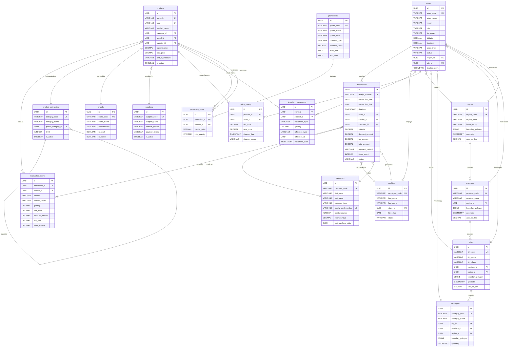

# Scout Analytics Entity Relationship Diagram

## Visual Database Schema

## Table Relationships Summary

### Primary Relationships

1. **Geographic Hierarchy**
   - regions → provinces → cities → barangays
   - stores linked to all geographic levels

2. **Product Hierarchy**
   - suppliers → products
   - brands → products
   - categories → products (with self-referencing hierarchy)

3. **Transaction Flow**
   - stores → transactions → transaction_items → products
   - cashiers → transactions
   - customers → transactions

4. **Inventory & Pricing**
   - stores ↔ products (via inventory_movements)
   - products → price_history
   - promotions → promotion_items → products

### Key Design Patterns

1. **Star Schema for Analytics**
   - transactions (fact table) at center
   - Dimensions: stores, products, customers, time, geography

2. **Normalized Geography**
   - Separate tables for each administrative level
   - Polygon boundaries for spatial queries
   - PostGIS geometry for performance

3. **Audit Trail**
   - price_history tracks changes
   - inventory_movements tracks stock
   - All tables have created_at/updated_at

4. **Flexible Hierarchies**
   - Self-referencing product_categories
   - Multi-level geographic hierarchy
   - Optional relationships (customers may be anonymous)

## Index Strategy

### Primary Indexes
- All primary keys (UUID)
- All unique constraints (codes, barcodes)
- All foreign keys

### Performance Indexes
- Date columns for time-based queries
- Geographic columns (GIST indexes)
- Status/active flags for filtering
- Frequently joined columns

### Composite Indexes
- (store_id, transaction_date) on transactions
- (product_id, transaction_date) on transaction_items
- (region_id, city_id) on stores

## Data Integrity Rules

### Constraints
1. **Unique Constraints**
   - store_code, receipt_number, barcode, sku
   - category_code, brand_code, supplier_code
   - loyalty_card_number

2. **Check Constraints**
   - prices >= 0
   - quantities > 0
   - dates in valid ranges
   - status in allowed values

3. **Foreign Key Constraints**
   - All relationships enforced
   - CASCADE on delete for child records
   - RESTRICT on delete for master data

### Business Rules (via Triggers)
1. Transaction total = sum of line items
2. Inventory movements on sales
3. Customer lifetime value updates
4. Geographic calculations on boundary updates
5. Updated_at timestamp maintenance