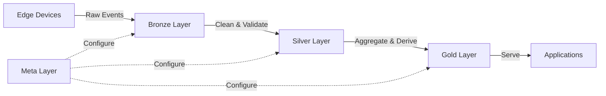

# Scout Analytics Medallion Architecture

## Overview

The Scout Analytics platform follows the Medallion architecture pattern for organizing data across Bronze, Silver, and Gold layers. This provides a clear progression from raw data ingestion to refined business-ready insights.

## Architecture Layers

### 🥉 Bronze Layer (Raw Data)
**Purpose**: Raw, unfiltered, semi-structured data directly from source systems

| Table/Collection | Description | Source | Format |
|-----------------|-------------|--------|---------|
| `bronze_transcriptions` | Raw STT (Speech-to-Text) logs | Edge devices | JSON/JSONB |
| `bronze_vision_detections` | OpenCV object detection events | Edge cameras | JSON/JSONB |
| `bronze_pos_transactions` | Raw POS transaction payloads | POS systems | JSON/JSONB |
| `bronze_inventory_events` | Stock movement raw events | Inventory systems | JSON/JSONB |
| `bronze_customer_interactions` | Raw interaction logs | Mobile/Web apps | JSON/JSONB |

**Access**: Service role only
**Retention**: 90 days (configurable)
**Processing**: Minimal - only timestamp and source validation

### 🥈 Silver Layer (Cleaned & Validated)
**Purpose**: Cleaned, joined, validated data with consistent schema

| Table/View | Description | Dependencies | Update Frequency |
|------------|-------------|--------------|------------------|
| `transactions` | Validated transaction records | bronze_pos_transactions | Real-time |
| `stores` | Store master data | Manual uploads | Daily |
| `products` | Product catalog | bronze_inventory_events | Hourly |
| `transaction_items` | Transaction line items | transactions, products | Real-time |
| `client_brands` | Client-brand relationships | Manual config | On change |
| `fact_sales_hourly` | Hourly aggregated sales | transactions | Hourly |
| `vw_dashboard_metrics` | Pre-joined dashboard view | Multiple silver tables | 15 min |

**Access**: Authenticated users with RLS
**Schema**: Strict, versioned
**Validation**: Data quality rules enforced

### 🥇 Gold Layer (Business-Ready)
**Purpose**: Aggregated, derived data optimized for BI and AI consumption

| Table/View | Description | Use Case | Refresh |
|------------|-------------|----------|---------|
| `predicted_metrics` | ML-generated forecasts | Predictive analytics | Daily |
| `generated_insights` | AI-generated insights | Natural language insights | Weekly |
| `ai_dashboard_kpis` | Pre-calculated KPIs | Executive dashboards | 5 min |
| `brand_performance_scores` | Composite brand metrics | Brand health tracking | Daily |
| `customer_segments` | Derived customer groups | Targeted marketing | Weekly |
| `substitution_patterns` | Product substitution matrix | Inventory optimization | Daily |

**Access**: Application services, BI tools
**Format**: Denormalized for performance
**Caching**: Redis/CDN enabled

### 🔧 Meta Layer (Cross-Cutting)
**Purpose**: Configuration and metadata that spans layers

| Table | Description | Layer Coverage |
|-------|-------------|----------------|
| `saved_queries` | User-defined queries | Silver → Gold |
| `ai_insight_templates` | AI analysis templates | Gold generation |
| `dimension_registry` | Master dimension metadata | All layers |
| `data_quality_rules` | Validation rules | Bronze → Silver |
| `etl_job_history` | Pipeline execution logs | All layers |

## Data Flow

## ETL Responsibilities

### Bronze → Silver
- **Owner**: Data Engineering
- **Tools**: Airflow, dbt
- **SLA**: < 5 minutes for streaming, < 1 hour for batch
- **Key Operations**:
  - Schema validation
  - Deduplication
  - Data type casting
  - Foreign key validation
  - Outlier detection

### Silver → Gold
- **Owner**: Analytics Engineering
- **Tools**: dbt, Spark
- **SLA**: < 15 minutes for critical KPIs, < 24 hours for ML features
- **Key Operations**:
  - Complex aggregations
  - Feature engineering
  - ML model scoring
  - Business rule application
  - Denormalization for performance

## Security & Access Control

### Row-Level Security (RLS) by Layer

| Layer | RLS Policy | Example |
|-------|----------|---------|
| Bronze | Service role only | No user access |
| Silver | Client/Region based | Users see only their assigned clients/regions |
| Gold | Role-based aggregates | Executives see all, managers see their scope |

### Column-Level Security

- PII fields masked in Silver layer
- Aggregated only in Gold layer
- Audit trail for all PII access

## Quality Gates

### Bronze → Silver
✓ Schema compliance
✓ Referential integrity
✓ Business rule validation
✓ Anomaly detection

### Silver → Gold
✓ Aggregation accuracy
✓ Statistical significance
✓ Trend continuity
✓ Forecast reliability

## Monitoring & Observability

### Key Metrics
- **Data Freshness**: Max age by layer
- **Pipeline Health**: Success rate, latency
- **Data Quality**: Validation pass rate
- **Volume Trends**: Row counts, growth rate

### Alerts
- Bronze: Source system outages
- Silver: Validation failures > 5%
- Gold: SLA breaches, accuracy degradation

## Best Practices

1. **Never query Bronze from applications** - Always use Silver or Gold
2. **GPT/AI models consume Gold only** - Ensures quality and performance
3. **User explorations via Silver** - Detailed but validated data
4. **Executive dashboards from Gold** - Pre-aggregated for speed
5. **Write new data to Bronze only** - Let ETL handle promotion

## Implementation Checklist

- [ ] Set up Bronze ingestion tables
- [ ] Configure Silver transformation pipelines
- [ ] Create Gold aggregation jobs
- [ ] Implement RLS policies per layer
- [ ] Set up monitoring dashboards
- [ ] Document data lineage
- [ ] Configure backup/recovery per layer
- [ ] Establish data retention policies

## Future Enhancements

1. **Platinum Layer**: Executive-only strategic metrics
2. **Real-time Stream Processing**: Kafka → Bronze → Silver streaming
3. **Feature Store**: ML feature versioning in Gold
4. **Data Mesh**: Domain-specific medallion architectures
5. **Automated Quality Scoring**: ML-based anomaly detection

---

*Last Updated: July 2025*
*Version: 1.0*
*Owner: Data Platform Team*